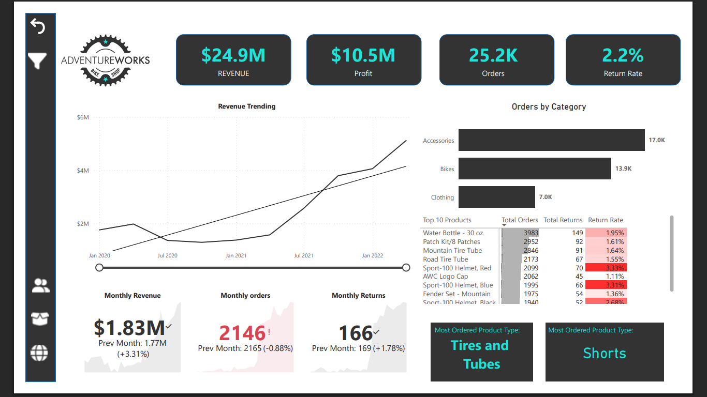
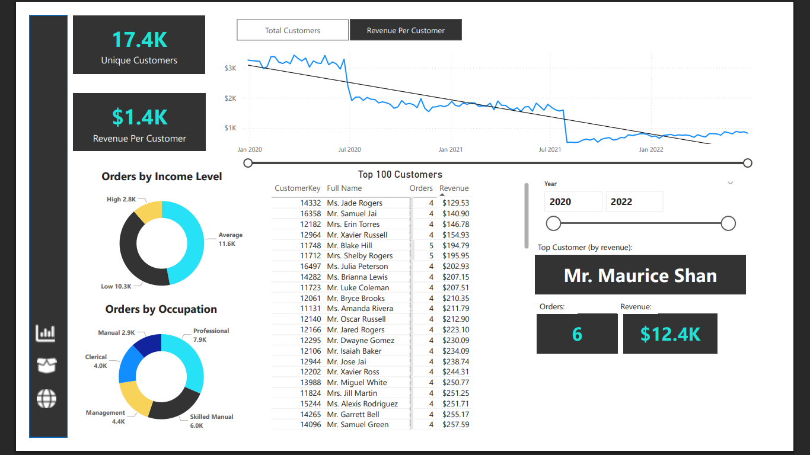
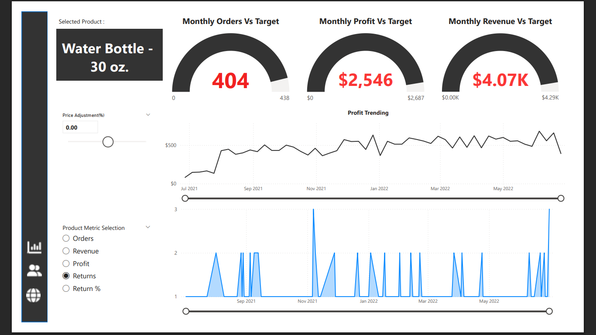
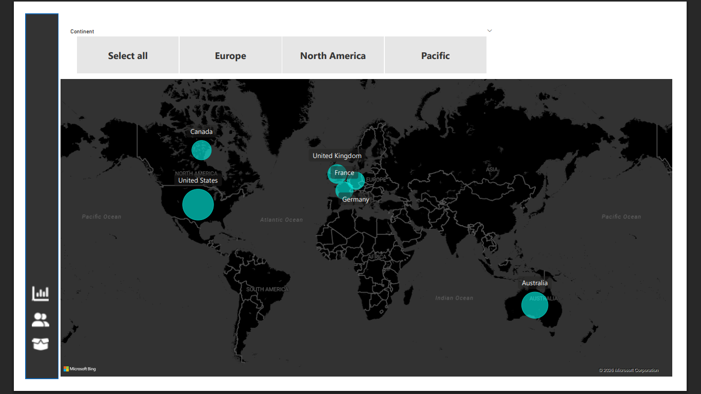

# 📊 AdventureWorks Power BI Dashboard

## 🚀 Project Overview

This project showcases an **interactive Power BI dashboard** built using the AdventureWorks dataset to analyze business performance across multiple dimensions including sales, customers, and products.

The dashboard provides a comprehensive view of key metrics and enables data-driven decision-making through intuitive visualizations.

---

## 🎯 Objective

To analyze and visualize:

* Revenue and profit trends
* Customer behavior and segmentation
* Product performance and return rates

---

## 🛠️ Tools & Technologies Used

* **Power BI** (Data Visualization)
* **DAX** (Data Analysis Expressions)
* **Excel / CSV** (Data Source)

---

## 📊 Key Features

* 📌 KPI Cards: Revenue, Profit, Orders, Return Rate
* 📈 Time Series Analysis (Revenue & Profit Trends)
* 👥 Customer Segmentation (Income Level & Occupation)
* 📦 Product Performance Analysis
* 🔍 Drill-through functionality (Executive → Customer → Product View)
* 🎯 Dynamic filters (Year, Product Selection)

---

## 📈 Key Insights

* Revenue shows a **consistent upward trend after mid-2021**
* Accessories category has the **highest number of orders (~17K)**
* Return rate is **low (~2.2%)**, indicating good product quality
* Some products have **higher return rates (>3%)**, requiring attention
* Top customers contribute significantly to total revenue
* Revenue per customer shows a **declining trend**, suggesting reduced spending
* Monthly orders fluctuate, indicating **seasonal demand patterns**

---

## 🖼️ Dashboard Preview

### 🔹 Executive Dashboard



### 🔹 Customer Dashboard



### 🔹 Product Dashboard



### 🔹 Continental Dashboard


---

## 📂 Project Structure

```
AdventureWorks-PowerBI-Dashboard/
│
├── Data/                # Dataset files
├── Dashboard/           # Power BI (.pbix) file
├── Images/              # Dashboard screenshots
└── README.md            # Project documentation
```

---

## ⚙️ How to Use

1. Download the `.pbix` file from the **Dashboard/** folder
2. Open it using **Power BI Desktop**
3. Interact with filters, slicers, and visuals

---

## 💡 Future Improvements

* Add Profit Margin & YoY Growth metrics
* Implement Forecasting using Power BI Analytics
* Include Customer Lifetime Value (CLV)
* Enhance UI with improved color themes

---

## 👨‍💻 Author

Aditya Shrivastav

Aspiring Data Analyst | Power BI | SQL | Python

---

## ⭐ If you found this useful

Give this repo a ⭐ and feel free to connect!
